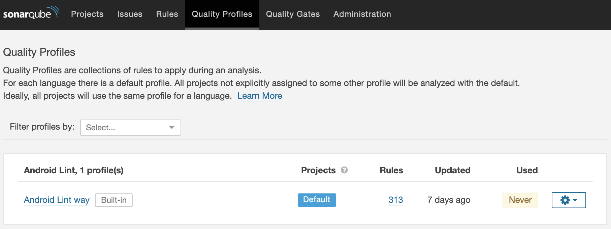
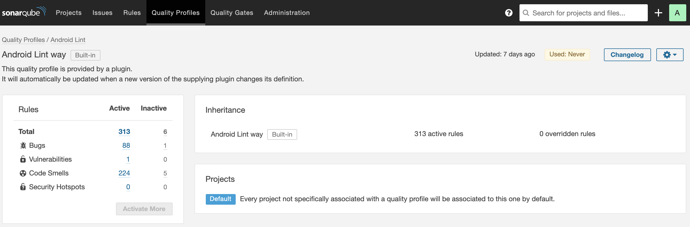

# SonarQube Android Lint Plugin
SonarQube plugin for supporting Android Lint

### Features

- Integrates Android Lint for static code analysis
- Up to date rules (1 vulnerability, 88 bugs, 224 code smells - 313 in total)
- Supports SonarQube 6.7.7 and up

### Plans

- Add support of custom lint checks
- Implement sensor that run Android Lint analysis on its own (not just parsing `lint-results.xml` file)

### Why?

There are several similar projects. 

One of them is [Android Lint Plugin](https://github.com/ofields/sonar-android).
But it's too old - the last commit was more than 4 years ago. Also, it doesn't support a lot of new rules provided 
by Android Lint.
 
Another one is [SLang](https://github.com/SonarSource/slang) with [Kotlin Plugin](https://github.com/SonarSource/slang/tree/master/sonar-kotlin-plugin).
It allows you to import Android Lint issues as `external`. You can read more about this type of issues here - 
[Importing Third-Party Issues](https://docs.sonarqube.org/latest/analysis/external-issues/).

The support of external issues looks nice if you are ok with its limitations:

> - you can't manage them within SonarQube; for instance, there is no ability to mark them False Positive.
> - you can't manage the activation of the rules that raise these issues within SonarQube. External rules aren't visible
> on the Rules page or reflected in Quality Profiles.
> - external issues and the rules that raise them must be managed in the configuration of your linter.

As result this plugin was developed for providing the native SonarQube's experience to work with Android Lint issues.

### Usage

Get the latest version from [releases page](https://github.com/jvilya/sonar-android-plugin/releases). Put the jar to 
`$SONAR_HOME/extensions/plugins` folder. Restart SonarQube.

Or build plugin by yourself

- `git clone https://github.com/jvilya/sonar-android-plugin`
- `cd sonar-android-plugin`
- `mvn package`
- `cp target/sonar-android-lint-[enter_version].jar $SONAR_HOME/extensions/plugins`
- `cd $SONAR_HOME/bin/[your_os]`
- `./sonar.sh restart`